# Cosmos DB Gremlin and Power BI
Produced by Dave Lusty and Marius Panga
# Introduction
In this demo we will configure Cosmos DB as a Gremlin database. We’ll then add some graph data to the database and query that using a visualisation in Power BI.
# Configure Cosmos DB
## Demo Environment
As ever with demos or indeed production, we want to encapsulate our service within a resource group so that we can easily manage it as a single entity later on. In the portal, create a new resource group and call it GremlinPowerBIDemo.

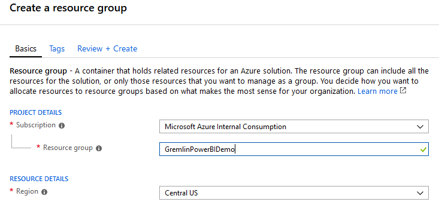

Optionally, add a tag to mark this as a demo environment. This will enable you to more easily find your demos later on when tidying up resources.

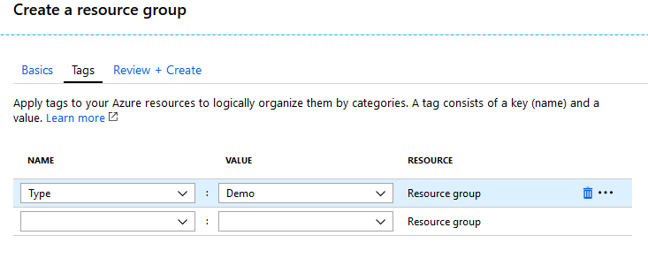

On the resource group page, you can filter by tags using the drop down at the top of the page as shown below:

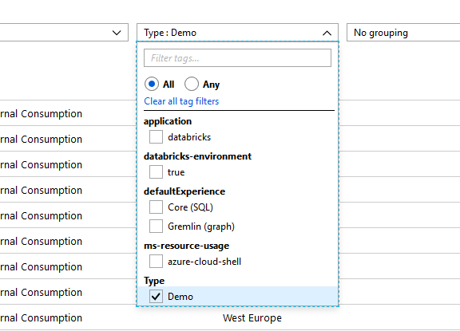

## Create Storage Account
In your resource group, create a storage account and give it a random name (for instance, your last name and the current date i.e. lusty03012019). Use LRS to keep costs down and place it into the GremlinPowerBIDemo resource group.


Now, find and download two pictures. One a book icon and one a person icon. Please respect copyright when using images from the Internet.

[book icons](images/https://www.google.com/search?as_st=y&tbm=isch&hl=en&as_q=book+icon+png&as_epq=&as_oq=&as_eq=&cr=&as_sitesearch=&safe=images&tbs=sur:f)

[person icons](images/https://www.google.com/search?as_st=y&hl=en&tbs=sur%3Af&tbm=isch&sa=1&ei=4_AtXIqwELu01fAPgd2lOA&q=person+icon+png&oq=person+icon+png&gs_l=img.3..0l7j0i7i30l3.30007.30777..61049...0.0..0.63.364.6......1....1..gws-wiz-img.i0r_FMwR7Ok)

You need to save these as book.png and author.png since these will match our labels in the database and the Power BI visualisation uses those labels.
Now, browse to your storage account and click Storage Explorer. Create a new container called images.

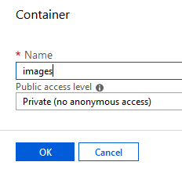

In this container, upload your two png files.
Set the access policy for your images container to Blob so that your files can be reached from the Internet. 

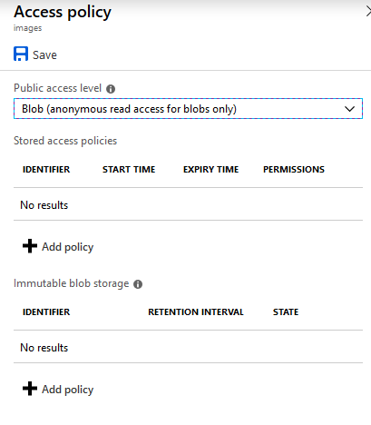

If you now open the properties of the images, you’ll get a URL for each which we will need later so note it down. This will look something like: https://lusty03012019.blob.core.windows.net/images/author.png. Try this in a browser to ensure you get the image. 
## Cosmos DB
In the portal, create a new Azure Cosmos DB instance. Select the GremlinPowerBIDemo resource group and name the account gremlin<yourname>2019. Since this is a public DNS endpoint it must be unique, hence using your name and the year for the demo. Select Gremlin (Graph) as the API for your database and an appropriate region. Disable Geo-Redundancy and Multi-
region Writes since we don’t need them and want to keep costs to a minimum.

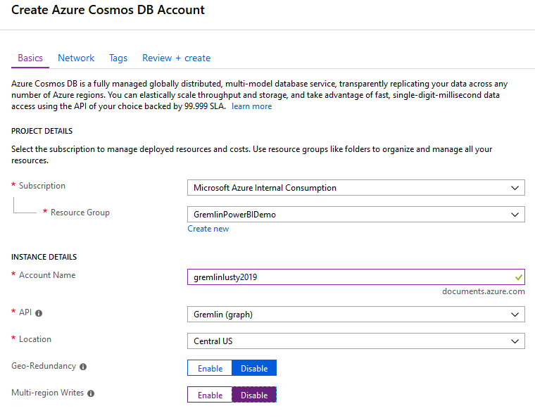

Click review and create and then create since we don’t need any other settings here. You can optionally add a tag but since we tagged the resource group and encapsulated the solution I generally don’t at this level. The Cosmos DB instance will take several minutes to provision.
## Gremlin Graph Database
Now that we have a Cosmos DB instance, we can create a database. Browse to the Cosmos DB resource in the portal and then click Data Explorer. From here we can create our new database.

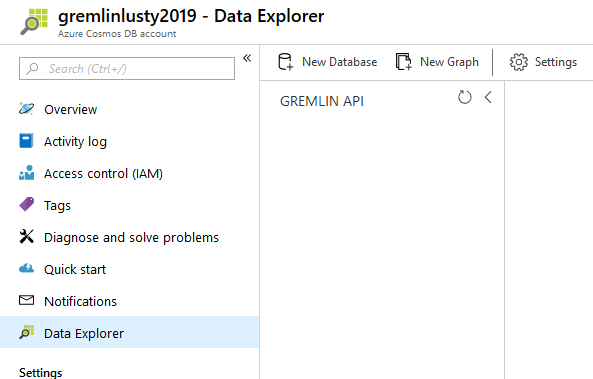

Click New Database and call it books. 

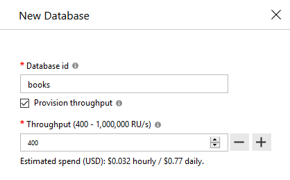

## Configure Graph
Now, click New Graph to set up a graph within your database. Choose your books database and call the collection bookCollection. If you didn’t set up throughput on the database, set it here to 400 RU/s to keep costs down for the demo.  **This is important**. Select Provision Throughput and set throughput to 400 either on the database or graph. The default 50,000 RU/s will cost you $96 a day. EVERY DAY YOU LEAVE IT RUNNING. This is just under $3000 per month.
For this demo we will use /name as the key. In production you should choose a key very carefully to ensure your database scales well.

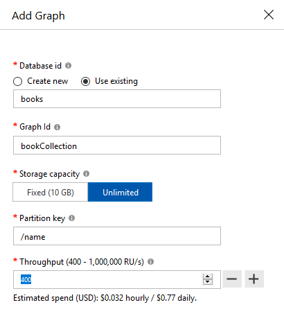

## Create Data Manually - Vertexes
You can now expand out the graph and add data by clicking on New Vertex.

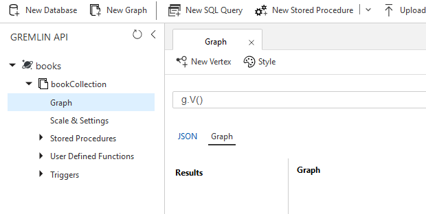

Here you can type arbitrary information and fields in to create Vertexes (also sometimes known as Nodes). Create your first author as below:

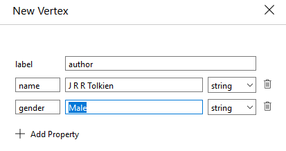

## Create Data Script - Vertexes
Since this is just a demo, we don’t want to spend a lot of time adding data, so we’ll use some scripting. In the query box, type the following:
```
g.addV('author').property('name','J K Rowling').property('gender','Female')
```
Then press Execute Gremlin Query. Don’t press enter as this does something else in the interface and appears to hang.

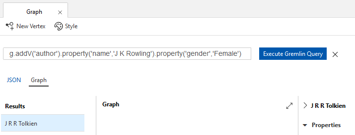

Repeat these steps with the following query:
```
g.addV('author').property('name','Luke Rhinehart').property('gender','Male')
```
We can string these together by simply putting a .addV on the end of the line:
```
g.addV('book').property('name','Harry Potter and the Philosophers Stone').property('pages','223').addV('book').property('name','Harry Potter and the Chamber of Secrets').property('pages','251').addV('book').property('name','Harry Potter and the Prisoner of Azkaban').property('pages','317').addV('book').property('name','Harry Potter and the Goblet of Fire').property('pages','636').addV('book').property('name','Harry Potter and the Order of the Phoenix').property('pages','766').addV('book').property('name','Harry Potter and the Half-Blood Prince').property('pages','607').addV('book').property('name','Harry Potter and the Deathly Hallows').property('pages','607')
```
I’ll tidy that up so you can see it more easily:
```
g.addV('book').property('name','Harry Potter and the Philosophers Stone').property('pages','223')
 .addV('book').property('name','Harry Potter and the Chamber of Secrets').property('pages','251')
 .addV('book').property('name','Harry Potter and the Prisoner of Azkaban').property('pages','317')
 .addV('book').property('name','Harry Potter and the Goblet of Fire').property('pages','636')
 .addV('book').property('name','Harry Potter and the Order of the Phoenix').property('pages','766')
 .addV('book').property('name','Harry Potter and the Half-Blood Prince').property('pages','607')
 .addV('book').property('name','Harry Potter and the Deathly Hallows').property('pages','607')
```
You can use shift and enter for new lines in your query to keep it neat, but they don’t affect the query at all. Finally, run the following to add some more data:
```
g.addV('book').property('name','The Hobbit').property('pages','310')
.addV('book').property('name','The Fellowship of the Ring').property('pages','423')
.addV('book').property('name','The Two Towers').property('pages','352')
.addV('book').property('name','The Return of the King').property('pages','416')
.addV('book').property('name','The Dice Man').property('pages','500')
```
## Create Data Manually – Edges
To create an edge and link two vertexes we need to select the vertex. To do this, run the query g.V() to return all of the vertexes, then browse to find the one you want. You’ll then see a screen like the below:

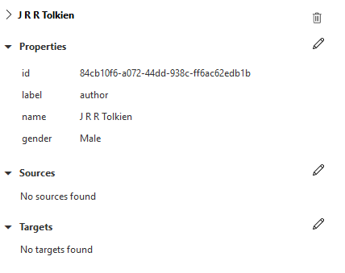

Here, we can create edges. These are directional, so JRR Tolkien wrote The Hobbit, while The Hobbit did not write JRR Tolkien. We can, of course create edges in both directions. Here, click on the pencil (edit button) in Sources to add an edge manually. Here you can type Hobbit and the system will find the record for you, so you just need to click on it. Then add the edge label as wrote and click the tick (OK).

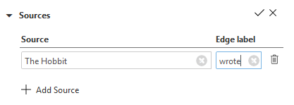

## Create Data Script – Edges
The following three scripts can now be run to create further edges. These will add edges for wrote, knows and read to link our vertexes.
```
g.V().has('author', 'name', 'J R R Tolkien').addE('wrote').from(g.V().has('book', 'name', 'The Fellowship of the Ring'))
.V().has('author', 'name', 'J R R Tolkien').addE('wrote').from(g.V().has('book', 'name', 'The Two Towers'))
.V().has('author', 'name', 'J R R Tolkien').addE('wrote').from(g.V().has('book', 'name', 'The Return of the King'))
```

```
g.V().has('author', 'name', 'Luke Rhinehart').addE('wrote').from(g.V().has('book', 'name', 'The Dice Man'))
.V().has('author', 'name', 'Luke Rhinehart').addE('read').from(g.V().has('book', 'name', 'The Fellowship of the Ring'))
.V().has('author', 'name', 'Luke Rhinehart').addE('read').from(g.V().has('book', 'name', 'The Two Towers'))
.V().has('author', 'name', 'Luke Rhinehart').addE('read').from(g.V().has('book', 'name', 'The Return of the King'))
.V().has('author', 'name', 'Luke Rhinehart').addE('knows').from(g.V().has('author', 'name', 'J K Rowling'))
```

```
g.V().has('author', 'name', 'J K Rowling').addE('knows').from(g.V().has('author', 'name', 'Luke Rhinehart'))
.V().has('author', 'name', 'J K Rowling').addE('wrote').from(g.V().has('book', 'name', 'Harry Potter and the Philosophers Stone'))
.V().has('author', 'name', 'J K Rowling').addE('wrote').from(g.V().has('book', 'name', 'Harry Potter and the Chamber of Secrets'))
.V().has('author', 'name', 'J K Rowling').addE('wrote').from(g.V().has('book', 'name', 'Harry Potter and the Prisoner of Azkaban'))
.V().has('author', 'name', 'J K Rowling').addE('wrote').from(g.V().has('book', 'name', 'Harry Potter and the Goblet of Fire'))
.V().has('author', 'name', 'J K Rowling').addE('wrote').from(g.V().has('book', 'name', 'Harry Potter and the Order of the Phoenix'))
.V().has('author', 'name', 'J K Rowling').addE('wrote').from(g.V().has('book', 'name', 'Harry Potter and the Half-Blood Prince'))
.V().has('author', 'name', 'J K Rowling').addE('wrote').from(g.V().has('book', 'name', 'Harry Potter and the Deathly Hallows'))
.V().has('author', 'name', 'J K Rowling').addE('read').from(g.V().has('book', 'name', 'The Hobbit'))
.V().has('author', 'name', 'J K Rowling').addE('read').from(g.V().has('book', 'name', 'The Dice Man'))
```
# Configure Power BI
## Set up Data Sources
Now that we have our data set up, we’re ready to go to Power BI and query some data. Open a new Power BI file and click Get Data. Search for Cosmos and select the connector. Note that this is currently in Beta, although I’ve had no issues so far.

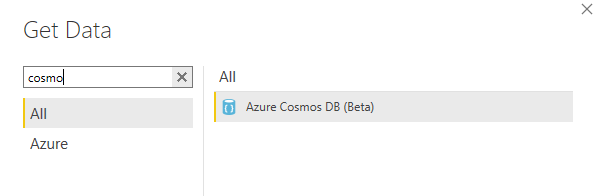

You’ll need to accept the preview box to acknowledge you know it’s not production ready or supported yet. (note: at some stage this won't be necessary once the connector is GA)

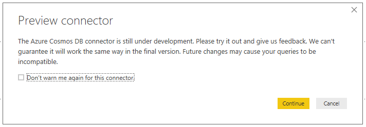

Next, fill in the data for your Cosmos DB instance that we set up earlier. Note that this is the documents.azure.com URI not the Gremlin endpoint.

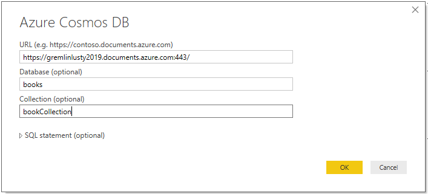

Next copy a key and paste it into the dialog. These can be found under Keys on the main page of Cosmos DB. We’ll use the primary key here but either will work.

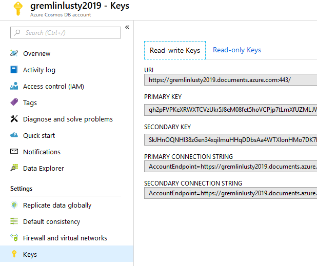

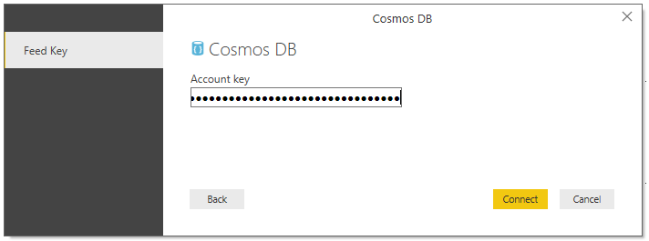

You should now get some data returned as in the below image.

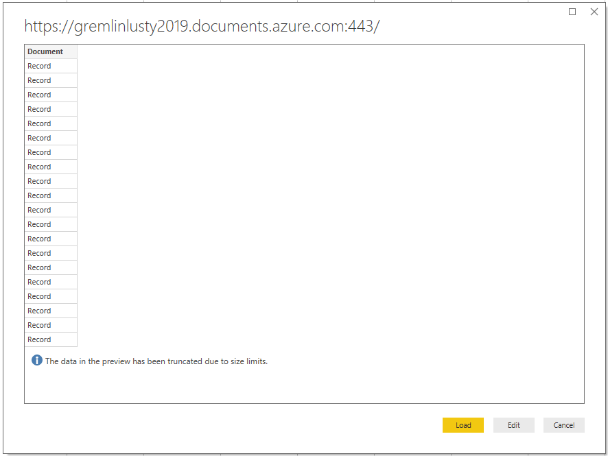

Since this is a collection of JSON documents you won’t see the information, just click Load for now.
Next, we need to modify the query for our data. Click Edit Queries and then rename Query1 to Nodes1. Select the query on the left. Right click and go to Advanced Editor. Add in the query as highlighted below. Bear in mind that your URI will be different so do not copy and paste this whole query.
```
let
    Source = DocumentDB.Contents("https://<YOURDBNAME>.documents.azure.com:443/", "books", "bookCollection", [Query = "SELECT * FROM authors a"])
in
    Source
```

Click Done to go back to the edit queries screen. Here, right click on Nodes1 and duplicate the query. Rename the copy (Nodes1 (2)) as Edges and then open the advanced editor for this new query. Change the query to the below to select only records with the _isEdge = true property.
```
let
    Source = DocumentDB.Contents("https://<YOURDBNAME>.documents.azure.com:443/", "books", "bookCollection", [Query = "SELECT * FROM edges e WHERE e._isEdge = true"])
in
    Source
```

Click done to return to the editor. Now with the Edges query selected, click one of the records and then the expand button on the top right of the column next to where it says Document.

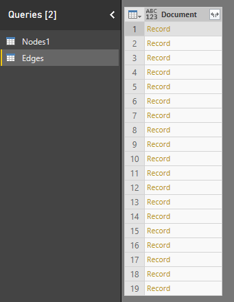

Here we need to select relevant properties to keep.

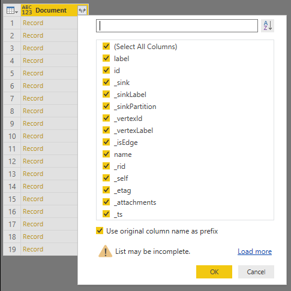

Unselect all and then choose just label, id, _sink, _sinklabel, _vertexId and _vertexlabel then click OK.

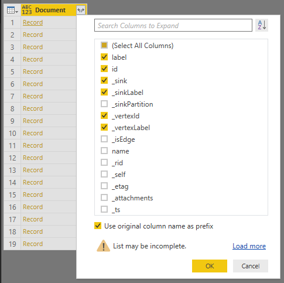

You’ll then see all of your edges and vertex IDs.

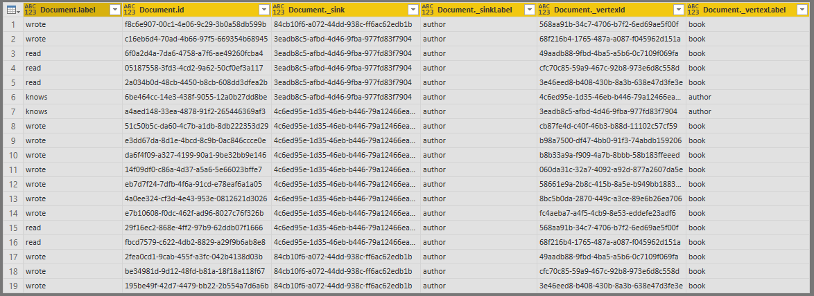

Next, we need to do the same for the node query, so click on Nodes1 and then the expand button.

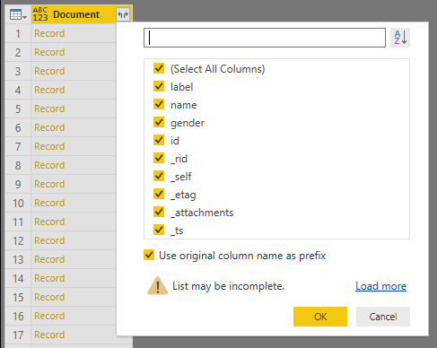

Here you can see that Power BI checked an author node as we can see gender but not pages. Click the load more button to load more until you have all possible properties.
When complete you should see the below:

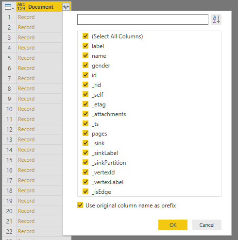

Select the useful ones (label, name, gender, pages and id). We use the id to link edges and vertexes.


Click OK and you’ll see the below:

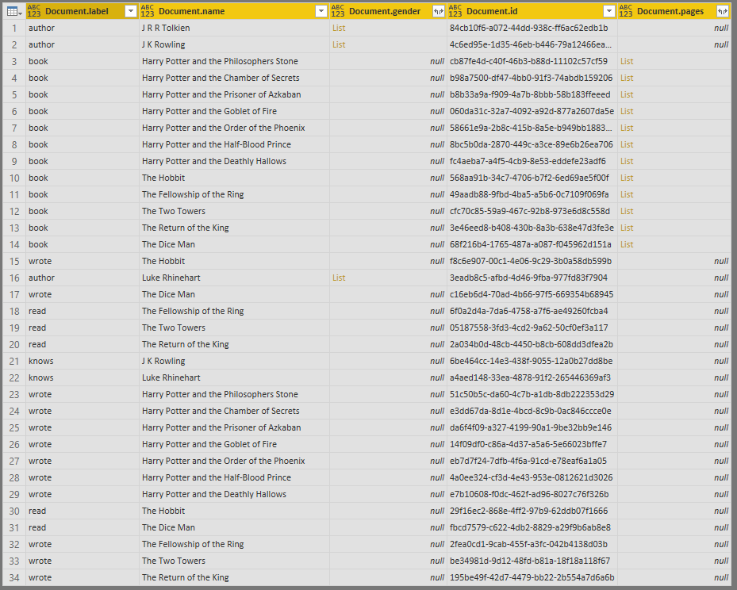

Note that we still aren’t finished since we can see neither gender nor pages information. We need to expand out those columns too. 

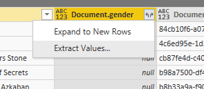

Choose Expand to New Rows. You’ll then see records appear and will need to expand again.

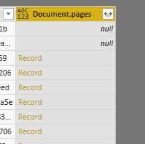

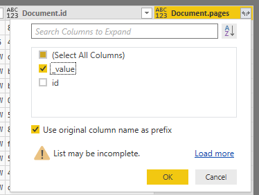

Here you can just select Value since we have no use for the ID in the demo.
Finally, we’ll filter out the edges from the table by adding a filter to the first column (Document.label). Filter to only select author and book.

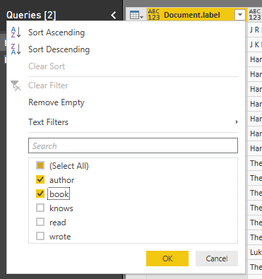

We now have just vertexes in the table:

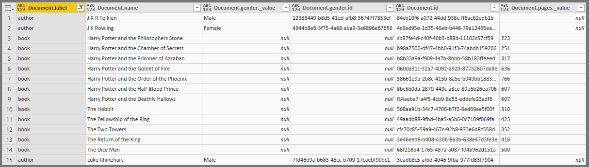

Now duplicate the Nodes1 query and name it Nodes2 then click Close and Apply. We need this second table since we can’t have two ID columns from the same table linking to one table. In the Relationships screen we need to link the Document.\_Sink to Document.id on one table, and Document.\_vertexId to the Document.id on the other.


We now have Power BI set up to query the data as a graph.
## Set up Visualisation
In the designer, click the ellipsis and import from marketplace.

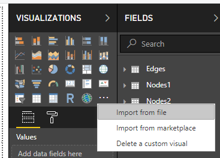

Search for Force-Directed Graph and add in the visualisation.

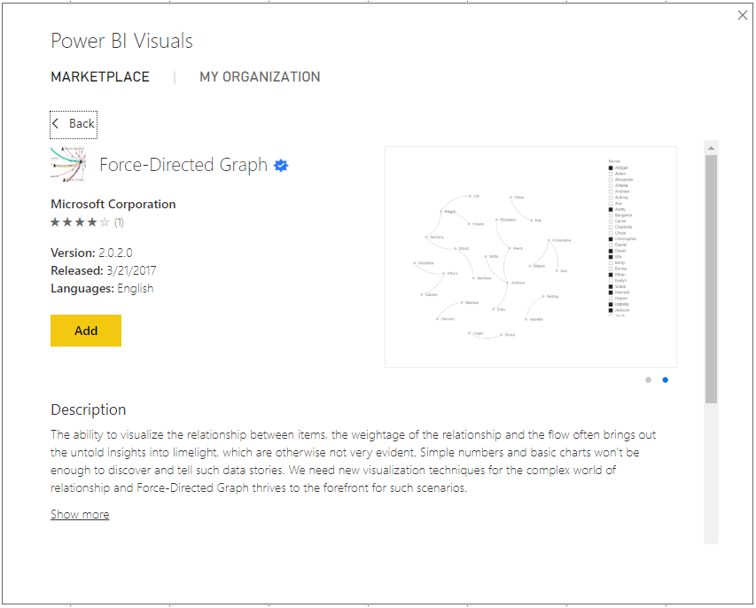

Add this visualisation to your canvas and then set up.
Now set up your visualisation as follows:
| Setting | Table | Value |
|---|---|---|---|---|
| Source | Table	| Value |
| Source	| Nodes1	| Document.Name |
| Target	| Nodes2	| Document.Name |
| Weight		| N/A	| N/A |
| Link	| Type	Edges	| Document.Label |
| Source Type	| Nodes1	| Document.Label |
| Target	Type	| Nodes2	| Document.Label |

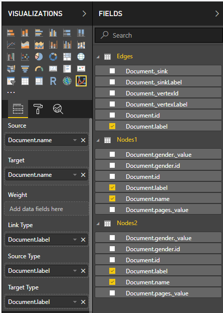

At this point you’ll see your data visualised as follows:

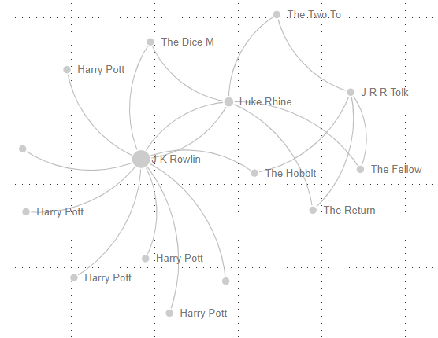

Just a little tidying left to do. We need to add images and fix the short names.
Click on the format button and change the Nodes settings. Here we need to change the Max name length to 50 because some of our book names are very long. Also flip image to “on” and enter the URI for your images in Blob up to and including the last / character.
Your URL will be something like:

https://lusty03012019.blob.core.windows.net/images/author.png

So, you enter:

https://lusty03012019.blob.core.windows.net/images/

ensure that your extension is .png and that the case matches your file names. 

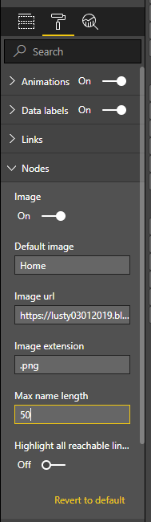

You should now see the following:

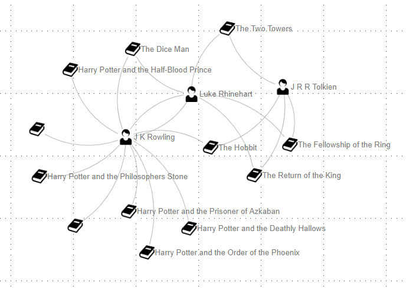

You can, of course, filter as usual and click and drag objects in the visualisation.
